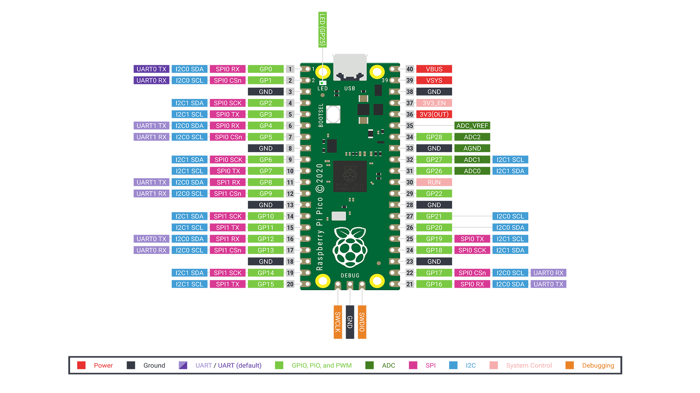

# Microcontrollers

## Atmel

 - [AVR Libc](https://www.nongnu.org/avr-libc/)

## ESP8266

 - [Wikipedia page](https://en.wikipedia.org/wiki/ESP8266)
 - [Datasheet](https://web.archive.org/web/20171201031911/http://espressif.com/sites/default/files/documentation/esp-wroom-02d_esp-wroom-02u_datasheet_en.pdf)

| Specs | Description |
|-----|----|
| Processor | L106 32-bit RISC microprocessor core based on the Tensilica Xtensa Diamond Standard 106Micro running at 80 MHz |
| Memory | 32 KiB instruction RAM 32 KiB instruction cache RAM 80 KiB user-data RAM 16 KiB ETS system-data RAM
| External QSPI flash | up to 16 MiB is supported (512 KiB to 4 MiB typically included) |
| IEEE 802.11 b/g/n Wi-Fi
| Integrated TR switch, balun, LNA, power amplifier and matching network
| WEP or WPA/WPA2 authentication, or open networks
| GPIOs | 16 pins |
| SPI | |
| I²C | (software implementation) |
| I²S | interfaces with DMA (sharing pins with GPIO)
| UART | on dedicated pins, plus a transmit-only UART can be enabled on GPIO2
| 10-bit ADC | (successive approximation ADC) |

## ESP32

| Specs | Description |
|-------|-------------|
| CPU | Xtensa LX6 |
| #core | 2 |
| Architecture | 32bit |
| CPU frequency | 160MHz - 240MHz |
| Voltage | 2v7 - 3v3 |
| Connectivity | Bluetooth (v4.2 BR/EDR and BLE), Wi-Fi (802.11 b/g/n) |
| RAM | 520KiB |
| Flash | ? |
| GPIOs | 34 (10 capacitive sensing) |
| SPI | 4 |
| I2C | 2 |
| I2S | 2 |
| UART | 3 |
| CAN  | 1 |
| ADC | 12bit, 18 channels |
| DAC | 8bit, 2 channels |
| PWM | Motor and LED (up to 16 channels) |
| Crypto | |

 - [Wikipedia page](https://en.wikipedia.org/wiki/ESP32)
 - [Datasheet](https://www.espressif.com/sites/default/files/documentation/esp32_datasheet_en.pdf)


 - [Video](https://www.youtube.com/watch?v=k_D_Qu0cgu8) ESP32 Dual Core on Arduino IDE including Data Passing and Task Synchronization

## RP2040

| Specs | Description |
|-------|-------------|
| CPU | Arm Cortex-M0+ |
| #core | 2 |
| Architecture | 32bit |
| CPU frequency | 133Mhz |
| Voltage | 2v7 - 3v3 |
| Connectivity | No |
| RAM | 264KB |
| Flash | 2MB |
| GPIOs | 30 |
| SPI | 2 |
| I2C | 2 |
| I2S | 0 |
| UART | 2 |
| CAN  | 0 |
| ADC | 12bit, 4 channels |
| DAC | 0 |
| Timers | 3 16bit |
| PWM | 16 |
| USB | 1.1 Host/Device |

 - Getting started with pico [pdf](https://datasheets.raspberrypi.org/pico/getting-started-with-pico.pdf)
 - [datasheet](https://datasheets.raspberrypi.org/rp2040/rp2040_datasheet.pdf)
 - [A closer look at Raspberry Pi RP2040 Programmable IOs (PIO)](https://www.cnx-software.com/2021/01/27/a-closer-look-at-raspberry-pi-rp2040-programmable-ios-pio/)
 - [Video](https://www.youtube.com/watch?v=yYnQYF_Xa8g) In-depth: Raspberry Pi Pico's PIO - programmable I/O!
 - [majbthrd/pico-debug](https://github.com/majbthrd/pico-debug) virtual debug pod for RP2040 "Raspberry Pi Pico" with no added hardware



## STM32F103C8T6

 [Reference manual](https://www.st.com/content/ccc/resource/technical/document/reference_manual/59/b9/ba/7f/11/af/43/d5/CD00171190.pdf/files/CD00171190.pdf/jcr:content/translations/en.CD00171190.pdf) | [datasheet](https://www.st.com/resource/en/datasheet/stm32f103c8.pdf)

There are a couple of boards with this microcontroller on it, mainly **blue
pill** and **black pill** (note that their pinout differ)

| Specs | Description |
|-------|-------------|
| CPU | Arm Cortex-M3 |
| #core | 1 |
| Architecture | 32bit |
| CPU frequency | 72Mhz |
| Voltage | 2v7 - 3v3 |
| Connectivity | No |
| RAM | 20KB |
| Flash | 64KB |
| GPIOs | 37 |
| SPI | 2 |
| I2C | 2 |
| I2S | 0 |
| UART | 3 |
| CAN  | 1 |
| ADC | 12bit, 10 channels |
| DAC | 0 |
| Timers | 3 16bit |
| PWM | 1 |


 - [stm32-base.org](https://stm32-base.org/)
 - [Bare Metal C on the Blue Pill](https://leap.tardate.com/arm/stm32f103c8t6/baremetal/)
 - [libopencm3/libopencm3](https://github.com/libopencm3/libopencm3) Open source ARM Cortex-M microcontroller library
 - [satoshinm/pill_blink](https://github.com/satoshinm/pill_blink) examples of blinking the STM32F103C8 "blue pill" development board (LED on PC13) using various methods

### ST Link

```
$ dmesg -w
 ...
[591582.793849] usb 2-10: new full-speed USB device number 99 using xhci_hcd
[591582.943077] usb 2-10: New USB device found, idVendor=0483, idProduct=3748, bcdDevice= 1.00
[591582.943089] usb 2-10: New USB device strings: Mfr=1, Product=2, SerialNumber=3
[591582.943094] usb 2-10: Product: STM32 STLink
[591582.943099] usb 2-10: Manufacturer: STMicroelectronics
[591582.943103] usb 2-10: SerialNumber: Qÿp\x06I\xc2\x86IQ1E\x17\xc2\x87
```

```
$ lsusb
 ...
Bus 002 Device 099: ID 0483:3748 STMicroelectronics ST-LINK/V2
 ...
```

 - [stlink-org/stlink](https://github.com/stlink-org/stlink) Open source version of the STMicroelectronics STlink Tools


There is Debian packages available to install dyrectly from github

```
$ st-info --version
v1.7.0
$ st-info --probe
Found 1 stlink programmers
  version:    V2J17S4
  serial:     51FF70064986495131451787
  flash:      65536 (pagesize: 1024)
  sram:       20480
  chipid:     0x0410
  descr:      F1xx Medium-density
```

```
$ st-util 
2021-04-28T18:20:32 WARN common.c: NRST is not connected
2021-04-28T18:20:32 INFO common.c: F1xx Medium-density: 20 KiB SRAM, 64 KiB flash in at least 1 KiB pages.
2021-04-28T18:20:32 INFO gdb-server.c: Listening at *:4242...
2021-04-28T18:20:34 WARN common.c: NRST is not connected
2021-04-28T18:20:34 INFO common.c: F1xx Medium-density: 20 KiB SRAM, 64 KiB flash in at least 1 KiB pages.
2021-04-28T18:20:34 INFO gdb-server.c: Found 6 hw breakpoint registers
2021-04-28T18:20:34 INFO gdb-server.c: GDB connected.
```

```
$ gdb-multiarch -n -q blink.elf
Reading symbols from blink.elf...
(gdb) target extended-remote :4242
Remote debugging using :4242
main () at blink.c:24
24              for (int i = 0; i < 500000; i++)
(gdb) load
Loading section .text, size 0x23c lma 0x8000000
Start address 0x080001b6, load size 572
Transfer rate: 3 KB/sec, 572 bytes/write.
```
