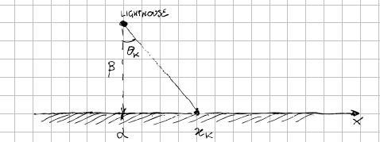

# Statistics

## Notation

$$
\eqalign{
P(A+B)  &= P(A\cup B) = P(A\,\hbox{or}\,B) = P(A) + P(B) - P(A\cap B)  \cr
P(A, B) &= P(A\cap B) = P(A\,\hbox{and}\,B) \cr
P(A | B) &= P(A\,\hbox{given}\,B) = {P(A\cap B)\over P(B)} \cr
}
$$

Two events are **mutually exclusive** when they are not happening at the same
time, i.e.

$$
P(A\cap B) = 0
$$

instead are considered **independent** where their probability is

$$
P(A \cap B) = P(A)P(B)
$$

note that these two concepts are not the same, i.e. two mutually exclusive
events might be not independent (trivially you can take the "complementary"
event and although is mutually exclusive, it's not independent).

## Bayes' theorem

$$
P(A|B) = {P(B|A)P(A)\over P(B)}
$$

 - **Forward probabilities:** generative model that computes the probability
   distribution of something produced by the process
 - **Inverse probabilities:** generative model that computes conditional
   probability of one or more **unobserved variables** in the process

An example of forward probabilities is the case of an urn with \\(K\\) balls,
\\(B\\) black and the remaining of color white. If we extract randomly one ball
\\(N\\) times we can describe the situation with a binomial distribution

$$
P(n_B|f_B, N) = {N\choose n_B}f^{n_B}_B \left(1 - f_B\right)^{N-n\_B}
$$

where \\(f_B={B\over K}\\).

Instead as example of inverse probabilities we can take eleven urns identified
by the label \\(u\in\{0,1,\dots, 10\}\\) containing ten balls each. The urn with
label \\(u\\) contains \\(u\\) black balls and \\(10 - u\\) white balls.

Now we select randomly one of the urn and we extract \\(N\\) balls (with
replacement) obtaining \\(n_B\\) black balls (and \\(N - n_B\\) white balls).

If we want to obtain the distribution of \\(u\\) based on the results, we can
use the Bayes' theorem:

$$
P(u|n_B, N) = {P(n_B|u,N)P(u)\over P(n_B|N)}
$$

We can use \\(P(u) = {1\over 11}\\) and

$$
P(n_B|u, N) = {N\choose n_B}f^{n_B}_u \left(1 - f_u\right)^{N-n\_B}
$$

where \\(f_u={u\over10}\\), i.e. the probability of a single extraction of a
black ball from a urn with label \\(u\\).

$$
P(u|n_B,N) = {1\over11}{1\over P(n_B|N)}{N\choose n_B}f^{n_B}_u\left(1 - f_u\right)^{N-n_B}
$$

Note that \\(P(u=0|n_B,N) = P(u=10|n_B,N) = 0\\); now it's possible to calculate
the probability that the next extraction will be a black ball

$$
\eqalign{
P(\hbox{ball}\_{N+1}\,\hbox{is black}|n_B,N) &= \sum^{10}\_{u=0}P(\hbox{ball}\_{N+1}\,\hbox{is black}|n_B,u,N)P(u|n_B,N) \cr
&= \sum^{10}\_{u=0}P(\hbox{ball}\,\hbox{is black}|u)P(u|n_B,N) \cr
&=\sum\_{u=0}^{10}f\_u P(u|n_B,N) \cr
&=\sum\_{u=0}^{10}{u\over 10}P(u|n_B,N) \cr
}
$$

## Notable problems

### Coupon's collector problem

Given \\(N\\) coupons, how many do you expect do you need to draw with
replacement before having drawn each coupon at least once?

The probability of obtaining the \\(i\\)-th coupon is

$$
P_i={N - \left(i - 1\right)\over N}
$$

so we can use a geometric distribution: the probability that at the step \\(x\\)
we have one event with probability \\(p\\) is then

$$
P(x) = \left(1 - p\right)^{x - 1}p
$$

Let \\(T\\) be the time to collect all the coupons, and let \\(T_i\\) be the
time to collect the \\(i\\)-th coupon, think of \\(T\\) and \\(t_i\\) as random
variables

$$
\eqalign{
T &= t_1 + t_2 + \dots + t_N\longrightarrow E[T] = E[t_1] + E[t_2] + \dots E[t_N]\cr
  &= {1\over P_1} + {1\over P_2} + \dots + {1\over P_N} \cr
  &= 1 + {N\over N - 1}\dots + N \cr
  &= N\left({1\over N} + {1\over N - 1}\dots + 1\right) \cr
  &= N\cdot H_n \cr
  &\sim N\ln N \cr
}
$$

### The lighthouse problem

A lighthouse is somewhere off a piece of straight coastline at a position \\(\alpha\\)
along the shore and distance \\(\beta\\) out of sea.

It emits a series of short highly collimated flashes at random intervals and
hence at random azimuts. These pulses are intercepted on the coast by
photo-detectors that record only the fact that a flash has occurred, but not the
angle from which it came.

The relation between a flash emitted from the lighthouse at position \\(\alpha,
\beta\\) with azimut \\(\theta\\) and the photo-detector at the shore \\(x\\) is
given by

$$
x - \alpha = \beta\tan(\theta)
$$

To find the likelihood \\(P(x\|\alpha,\beta,I)\\) we need to start from
\\(P(\theta\|\alpha,\beta,I)\\) but this is assumed to be uniformed distributed

$$
P(\theta\|\alpha,\beta,I) = {1\over\pi}\;\hbox{where}\;-\pi\leq\theta\lt\pi
$$

Changing variables we have that

$$
P(x\|\alpha,\beta,I) = {1\over\pi}{\beta\over\beta^2 + \left(x - \alpha\right)^2}
$$

that is a **Cauchy distribution**. Since the observations \\(\lbrace x_k\rbrace\\) are
independent we can write

$$
P(\lbrace x_k\rbrace\|\alpha,\beta,I) = \Pi_{k=1}^N P(x_k\|\alpha,\beta,I) =
\left(\beta\over\pi\right)^N \Pi_{k=1}^N {1\over \beta^2 + \left(x_k - \alpha\right)^2}
$$

If you want an example of **maximum likelihood estimation** see [this
script](mle.py)

## Links

 - [Notes with python](https://people.duke.edu/~ccc14/sta-663/MonteCarlo.html)
