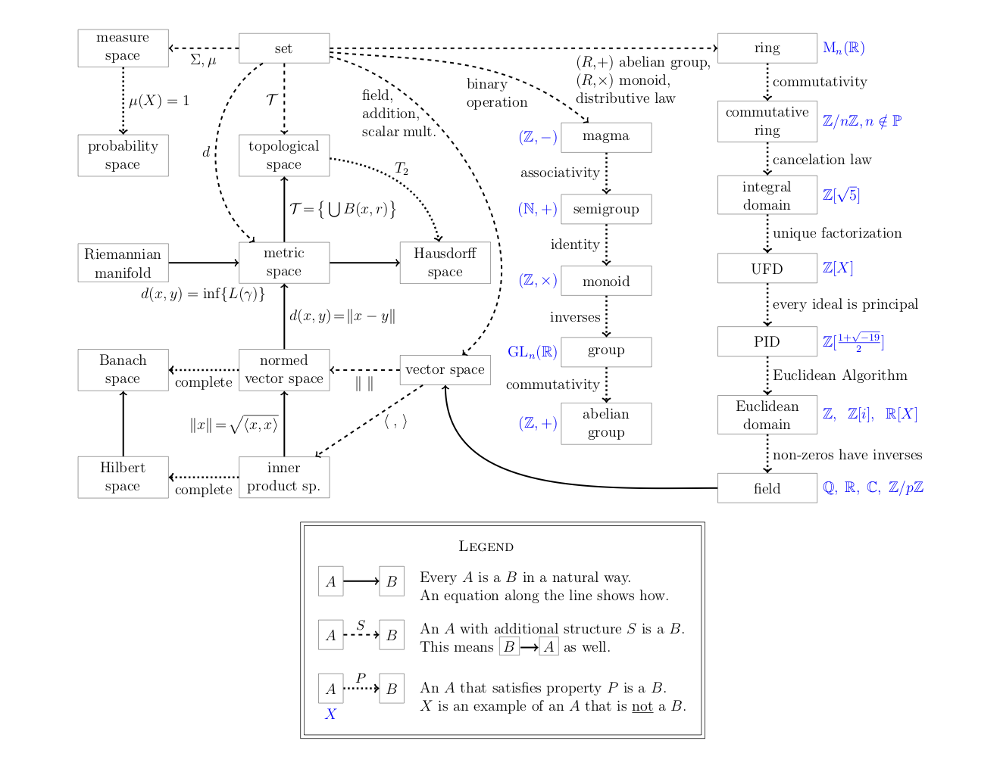
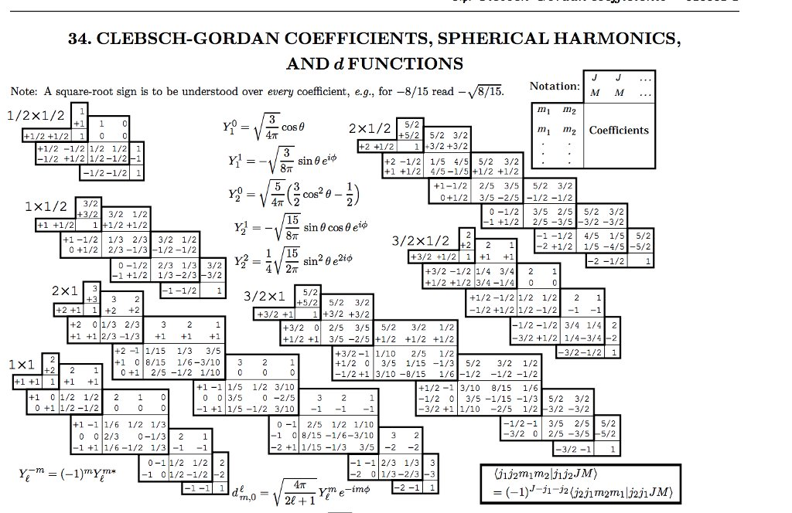

# Math, Physics and Computation

 - [Dissolving the Fermi Paradox](https://aleph.se/andart2/space/seti/dissolving-the-fermi-paradox/)
 - [How can electrons be “topological”?](https://gravityandlevity.wordpress.com/2020/07/14/how-can-electrons-be-topological/)

## Logic

 - [What Gödel Discovered](https://stopa.io/post/269)

## Topology

 - [Topology, A Categorical Approach](https://topology.mitpress.mit.edu/)

## Quantum mechanics

 - [A single quantum cannot be cloned](https://www.nature.com/articles/299802a0)
 - [Quantum Copying: Beyond the No-Cloning Theorem](https://arxiv.org/abs/quant-ph/9607018)
 - [Double Slit Experiment and Bayes](https://www.yulingyao.com/blog/2019/double-slit/)

## Life

 - [DNA seen through the eyes of a coder](https://berthub.eu/amazing-dna/) or If you are a hammer, everything looks like a nail
 - [Reverse Engineering the source code of the BioNTech/Pfizer SARS-CoV-2 Vaccine](https://berthub.eu/articles/posts/reverse-engineering-source-code-of-the-biontech-pfizer-vaccine/)

## Information theory

The information is measured using the following formula

$$
I(p) = \log_2\left(1\over p\right)
$$

It's possible to define the **Entropy** for a system using an alphabet of \\(q\\)
simbols with probabilities \\(p_i\\) as the average amount of information

$$
H(P) = \sum_{i=1}^q p_i\log\left(1\over p_i\right)
$$

It's possible to demonstrate that the maximum value for \\(H\\) is obtained with
symbols having all the same probabilities; moreover it's possible to show that

$$
H(P) \leq L = \hbox{average code length}
$$

## Galois's theory

 - [Field and Galois theory](http://www.math.clemson.edu/~macaule/classes/f21_math4120/slides/math4120_slides_section6_h.pdf)
