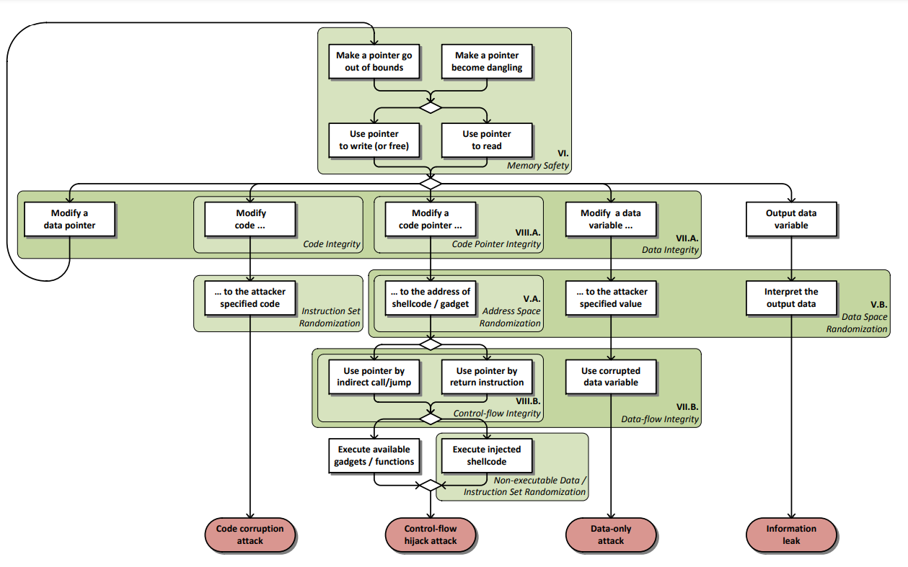

# Vulnerabilities

 - [Counterfeit Object-oriented Programming: On the Difficulty of Preventing Code Reuse Attacks in C++ Applications](https://www.computer.org/csdl/proceedings-article/sp/2015/6949a745/17D45VsBU41)
   paper showing that many of the defenses that do not consider
   object-oriented C++ semantics precisely can be generically bypassed in
   practice. A novel attach, counterfeit object-oriented programming (COOP), induces malicious program behavior by only invoking
   chains of existing C++ virtual functions in a program through corresponding existing call site
 - [SoK: Eternal War in Memory](https://people.eecs.berkeley.edu/~dawnsong/papers/Oakland13-SoK-CR.pdf):
   paper that systematize the knowledge about various protection techniques by
   setting up a general model for memory corruption attacks

